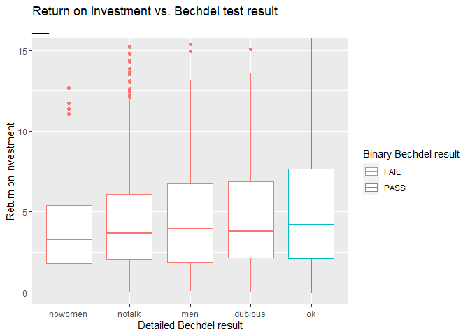

Bechdel
================
Naomi Ekas

In this mini analysis we work with the data used in the FiveThirtyEight
story titled [“The Dollar-And-Cents Case Against Hollywood’s Exclusion
of
Women”](https://fivethirtyeight.com/features/the-dollar-and-cents-case-against-hollywoods-exclusion-of-women/).
Your task is to fill in the blanks denoted by `___`.

## Data and packages

We start with loading the packages we’ll use.

``` r
library(fivethirtyeight)
library(tidyverse)
```

The dataset contains information on 1794 movies released between 1970
and 2013. However we’ll focus our analysis on movies released between
1990 and 2013.

``` r
bechdel90_13 <- bechdel %>% 
  filter(between(year, 1990, 2013))
```

There are `___` such movies.

The financial variables we’ll focus on are the following:

-   `budget_2013`: Budget in 2013 inflation adjusted dollars
-   `domgross_2013`: Domestic gross (US) in 2013 inflation adjusted
    dollars
-   `intgross_2013`: Total International (i.e., worldwide) gross in 2013
    inflation adjusted dollars

And we’ll also use the `binary` and `clean_test` variables for
**grouping**.

## Analysis

Let’s take a look at how median budget and gross vary by whether the
movie passed the Bechdel test, which is stored in the `binary` variable.

``` r
bechdel90_13 %>%
  group_by(binary) %>%
  summarise(med_budget = median(budget_2013),
            med_domgross = median(domgross_2013, na.rm = TRUE),
            med_intgross = median(intgross_2013, na.rm = TRUE))
```

    ## # A tibble: 2 x 4
    ##   binary med_budget med_domgross med_intgross
    ##   <chr>       <dbl>        <dbl>        <dbl>
    ## 1 FAIL    48385984.    57318606.    104475669
    ## 2 PASS    31070724     45330446.     80124349

Next, let’s take a look at how median budget and gross vary by a more
detailed indicator of the Bechdel test result. This information is
stored in the `clean_test` variable, which takes on the following
values:

-   `ok` = passes test
-   `dubious`
-   `men` = women only talk about men
-   `notalk` = women don’t talk to each other
-   `nowomen` = fewer than two women

``` r
bechdel90_13 %>%
  #group_by(___) %>%
  summarise(med_budget = median(budget_2013),
            med_domgross = median(domgross_2013, na.rm = TRUE),
            med_intgross = median(intgross_2013, na.rm = TRUE))
```

    ## # A tibble: 1 x 3
    ##   med_budget med_domgross med_intgross
    ##        <int>        <dbl>        <dbl>
    ## 1   37878971     52270207     93523336

In order to evaluate how return on investment varies among movies that
pass and fail the Bechdel test, we’ll first create a new variable called
`roi` as the ratio of the gross to budget.

``` r
bechdel90_13 <- bechdel90_13 %>%
  mutate(roi = (intgross_2013 + domgross_2013) / budget_2013)
```

Let’s see which movies have the highest return on investment.

``` r
bechdel90_13 %>%
  arrange(desc(roi)) %>% 
  select(title, roi, year)
```

    ## # A tibble: 1,615 x 3
    ##    title                     roi  year
    ##    <chr>                   <dbl> <int>
    ##  1 Paranormal Activity      671.  2007
    ##  2 The Blair Witch Project  648.  1999
    ##  3 El Mariachi              583.  1992
    ##  4 Clerks.                  258.  1994
    ##  5 In the Company of Men    231.  1997
    ##  6 Napoleon Dynamite        227.  2004
    ##  7 Once                     190.  2006
    ##  8 The Devil Inside         155.  2012
    ##  9 Primer                   142.  2004
    ## 10 Fireproof                134.  2008
    ## # ... with 1,605 more rows

Below is a visualization of the return on investment by test result,
however it’s difficult to see the distributions due to a few extreme
observations.

``` r
ggplot(data = bechdel90_13, 
       mapping = aes(x = clean_test, y = roi, color = binary)) +
  geom_boxplot() +
  labs(title = "Return on investment vs. Bechdel test result",
       x = "Detailed Bechdel result",
       y = "___",
       color = "Binary Bechdel result")
```

<!-- -->

What are those movies with *very* high returns on investment?

``` r
bechdel90_13 %>%
  filter(roi > 400) %>%
  select(title, budget_2013, domgross_2013, year)
```

    ## # A tibble: 3 x 4
    ##   title                   budget_2013 domgross_2013  year
    ##   <chr>                         <int>         <dbl> <int>
    ## 1 Paranormal Activity          505595     121251476  2007
    ## 2 The Blair Witch Project      839077     196538593  1999
    ## 3 El Mariachi                   11622       3388636  1992

Zooming in on the movies with `roi < ___` provides a better view of how
the medians across the categories compare:

``` r
ggplot(data = bechdel90_13, mapping = aes(x = clean_test, y = roi, color = binary)) +
  geom_boxplot() +
  labs(title = "Return on investment vs. Bechdel test result",
       subtitle = "___", # Something about zooming in to a certain level
       x = "Detailed Bechdel result",
       y = "Return on investment",
       color = "Binary Bechdel result") +
  coord_cartesian(ylim = c(0, 15))
```

<!-- -->
